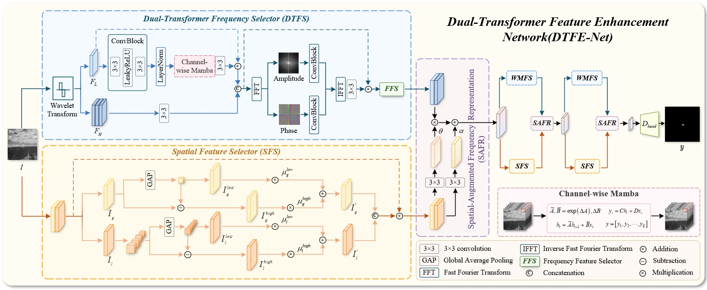

#  Dual-Transformer Feature Enhancement for Infrared Small-Dim Target Detection

This is the code for "Dual-Transformer Feature Enhancement for Infrared Small-Dim Target Detection"(DTFE-Net)

  
   
  <em>Figure 1: The overall architecture of DTFE-Net</em>

# 1. Data preparation

This experiment includes multiple public datasets, which are introduced below one by one. The quadruple bicubic interpolation required in the DCHFR branch is included in the code. Additionally, since DCHFR incorporates a diffusion model, its testing process is relatively slower. To avoid affecting the training progress, you may consider extending the testing interval or reducing the number of test images.

## 1.1 "NUAA"

* dataset: https://github.com/YimianDai/sirst

* paper doi: 10.1109/WACV48630.2021.00099

* description: SIRST is a dataset specially constructed for single-frame infrared small target detection, in which the images are selected from hundreds of infrared sequences for different scenarios.

* path format
  
  images: "your root path/train_imgs/xxx.png", "your root path/test_imgs/xxx.png", where "xxx" will be automatically retrieved in the code.

  labels: "your root path/train_labels/xxx.png", "your root path/test_labels/xxx.png", where "xxx" will be automatically retrieved in the code.

## 1.2 "NUDT"

* dataset: https://github.com/YeRen123455/Infrared-Small-Target-Detection

* paper doi: 10.1109/TIP.2022.3199107

* description: NUDT-SIRST dataset is a synthesized dataset, which contains 1327 images with resolution of 256x256.

* path format
  
  images: "your root path/train_imgs/xxx.png", "your root path/test_imgs/xxx.png", where "xxx" will be automatically retrieved in the code.

  labels: "your root path/train_labels/xxx.png", "your root path/test_labels/xxx.png", where "xxx" will be automatically retrieved in the code.

## 1.3 "IRSTD"

* dataset: https://github.com/RuiZhang97/ISNet

* paper doi: 10.1109/CVPR52688.2022.00095

* description: IRSTD-1k dataset is the realistic infrared small target detection dataset, which consists of 1,001 manually labeled realistic images with various target shapes, different target sizes, and rich clutter back-grounds from diverse scenes.

* path format
  
  images: "your root path/train_imgs/xxx.png", "your root path/test_imgs/xxx.png", where "xxx" will be automatically retrieved in the code.

  labels: "your root path/train_labels/xxx.png", "your root path/test_labels/xxx.png", where "xxx" will be automatically retrieved in the code.
  

# 3.Train

* change “--root” to your root path

* choose "--dataset_type", "--phase"
 
* set appropriate parameters, including "--base_size", "--batch_size", "--val_batch_size", "--num_worker", "--n_epoch" and "--val_freq"

* you can also modify the result save location ("--results_mask") and weight file save location ("--save_path") if needed

* If you need to use WANDB for visualization, please set your key first (os.environ["WANDB_API_KEY"] = "xxxx").

* python train.py`

  
# 4.Test

* change “--root” to your root path
 
* set appropriate parameters, including "--base_size", "--batch_size", "--val_batch_size", "--num_worker", "--n_epoch" and "--val_freq"

* chose the weight file save location ("--save_path") for loading model

* python test.py`
